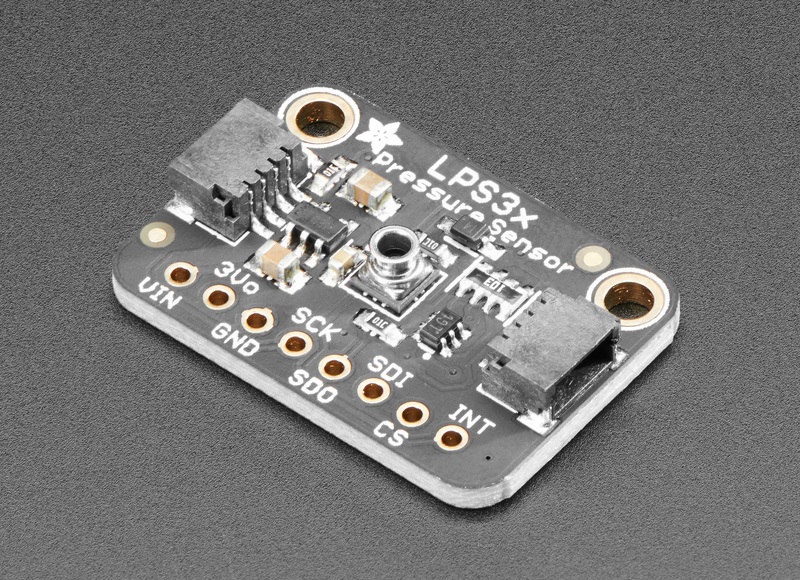
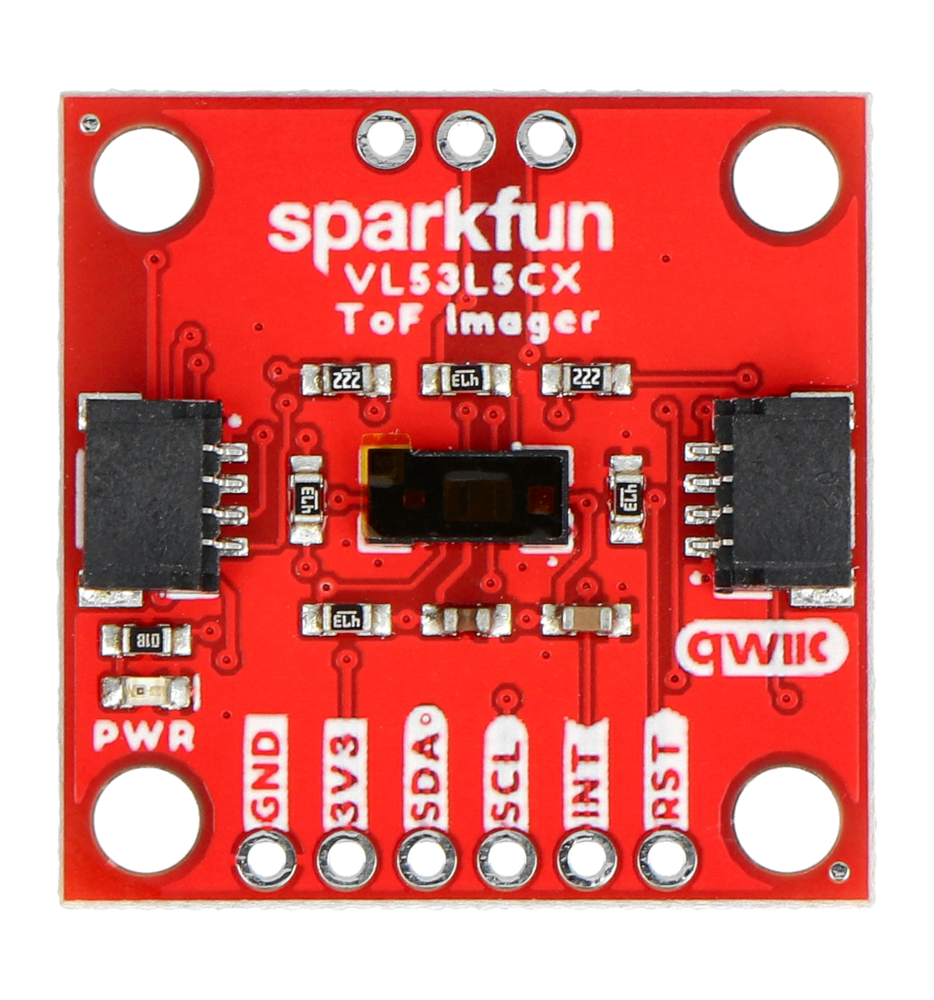
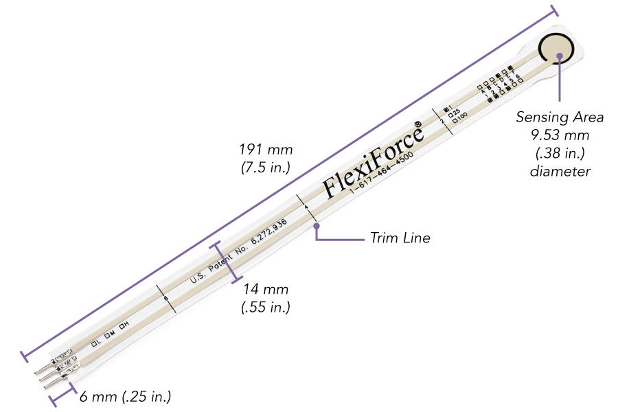
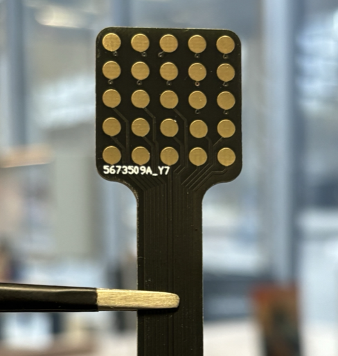
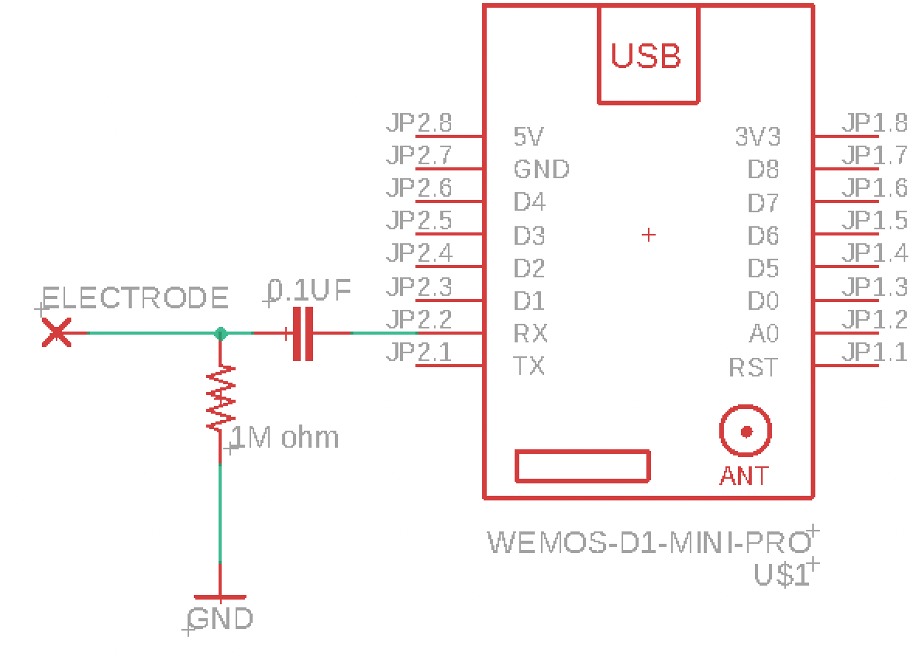
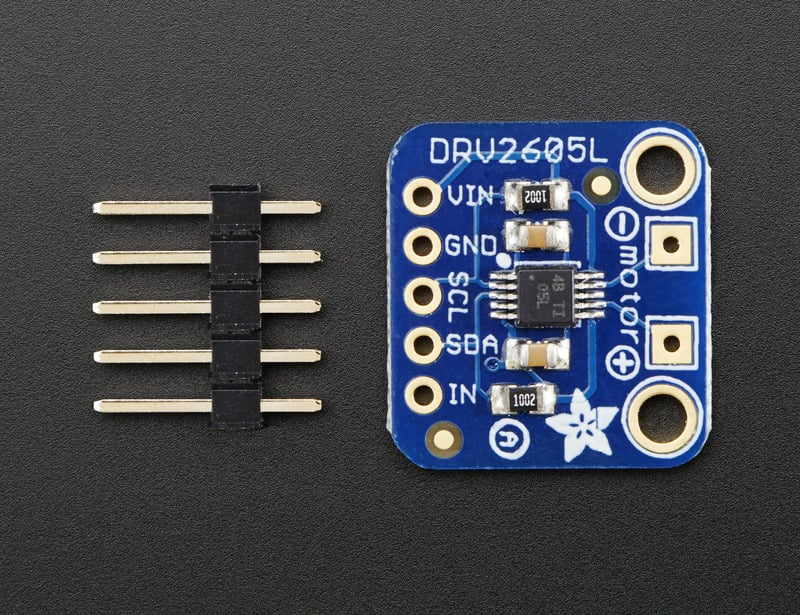

# Accessibility Design

## Workshop

**Tangible Music Lab, Linz**  
24.11.2025 - 26.11.2025

## Lecturers

- Luke Franzke
- Gerhard Nussbaum

## Overview

Eating, kissing, singing, blowing, spitting, whistling and biting; our mouths have many talents. These abilities are aided by a divers range of sensory faculties in the oral cavity, which is paired with precise and fatigue-resistant motor abilities. On top of this, all mouth function is supported by the hypoglossal cranial nerve, which is typically unharmed in spinal cord injuries and less affected by neuromuscular disorders, making the mouth an essential means of operating accessibility aids and devices human-computer interaction for people with disabilities.

However, the mouth remains relatively unexplored as a means of interfacing with digital music tools and instruments. In this workshop, we will investigate this and expose new possibilities for tangible interfaces for music making, which are inclusive and accessible to a broad range of bodies, and provide a diversity of embodied experiences and sensory modalities in their use.

## What to bring

- A cooking spoon (round handle recommended)
- Personal computer
- S2 Mini (or other microcontroller)
- USB cable
- Any assorted electronics at hand: jumper wires, breadboards, etc.

## Schedule

### Monday

- 14:00 Kick-off (exercise)
  - Writing with the mouth
  - Operating a computer or instrument with mouthpiece
- 14:30 Introduction Lecture: Luke Franzke
- 15:00 Introduction Lecture: Gerhard Nussbaum
- 15:30 Break
- 15:45 Design Brief
- 16:00 Hardware introduction
- 16:30 Brainstorming
- 17:00 Wrap up

### Tuesday

- 10:00 Progress round: Initial Concepts
- 10:30–11:30 Hardware Introduction (continued)
- 11:30–13:00 Prototyping and Mentoring
- 14:00–17:00 Prototyping and Mentoring

### Wednesday

- 10:00–14:00 Prototyping and Mentoring
- 15:30 Final Demonstration of Prototypes
- 16:00 Documentation of Results
- 16:45 Wrap Up

## Design Brief

Create a musical object or instrument that can be used via a novel mouth interface, without the need of the hands. Consider the enactive aspects of the interaction and the sensory qualities of the user experience: there will always be both sensory and motor aspects involved in any user interaction, but how might you design this to provide additional layers of information and enhance the joy of the experience? Take care with hygiene and ensure any components touching the mouth can be easily washed/sterilised, or replaced. Gerhard will test your devices and provide feedback in terms of usability and the qualities of the experience.

## Deliverables

- A short (one paragraph) description of the results (Title, Names, Description)
- A small selection of images and a video showing the results in use

## Methods and Materials for Motor Modalities

### Sip’n’puf

  

A sip‑n‑puff interface is one of the earliest devices for human‑computer interaction via the mouth, originally allowing a binary selection by blowing out or sucking in through a straw or tube. It’s quite simple to build such a device using an atmospheric pressure sensor and some tubing. Modern sensors offer high precision, allowing for continuous modes of interaction while sucking or blowing. Blowing directly across the sensor, like blowing a flute, also provides a small but measurable pressure difference. Any design requires the quick replacement of tubing for hygienic reasons.

**CircuitPython libraries**

- LPS3x:
  - [Adafruit_lps35hw.mpy](https://github.com/adafruit/Adafruit_CircuitPython_LPS35HW/releases)
  - [adafruit_bus_device](https://github.com/adafruit/Adafruit_CircuitPython_BusDevice/releases)
  - [Adafruit_register](https://github.com/adafruit/Adafruit_CircuitPython_Register/releases)

- LPS38:
  - [Python_LPS28](https://github.com/adafruit/Adafruit_CircuitPython_LPS28/releases)

**Example code**: [PuffSip - example (Examples/PuffSip.py)](Examples/PuffSip.py)

### TOF array for mouth gestures

  

Several attempts have been made using computer vision systems to recognise mouth gestures for accessible interfaces. Commercial devices like the Vive Face Tracker have also been repurposed as accessible interfaces [(Jain, Salter, 2025)](https://dl.acm.org/doi/full/10.1145/3706599.3706677?casa_token=yqmrP0_723YAAAAA%3AgM28vCJeZKTqviv5KqQGDQcmCifpm5Rq8sTSUZ1dMLEbI_NuM1IEuaYoSDvvCg2Y60Yek7XSmwCu5V0). The VLC5L5TX time-of-flight distance array provides an 8×8 grid of distance measurements, which can capture pronounced facial gestures in any lighting condition. Gestures such as opening the mouth, puffing the cheeks, or protruding and pointing with the tongue can be captured; robust usage may require machine learning.

**CircuitPython libraries**

- [CircuitPython_VL53LxCX](https://github.com/sensebox/CircuitPython_VL53LxCX/releases/tag/0.0.5)

**Example code**: [TOFimager - example (Examples/TOFimager.py)](Examples/TOFimager.py)

### Force sensors

  

A simple force sensor can capture pressure applied by the tongue, biting with the teeth, or pressure from the lips or cheeks. The thin‑film form factor allows great versatility, but the devices will need to be hermetically protected for both hygienic and sensor durability. A force sensor can easily be read via a microcontroller's analog pin (ADC) and a simple voltage divider circuit.

More info: https://www.tekscan.com/flexiforce-loadforce-sensors-and-systems

### Capacitive touch

Capacitive touch allows any conductive surface to be transformed into a touch interface. Only a single high value resistor is needed for the circuit (typically 1M ohm). 

Guide: https://learn.adafruit.com/adafruit-qt-py-esp32-s2/capacitive-touch

## Methods and Materials for Sensory Modalities

#### Surface exciter / bone conduction

When eating, many of the tactile qualities of food are perceived via sound conducted through bone to the ears. A surface exciter attached to a wooden paddle clenched between the teeth can provide a clear sound for the user. The user can stop the sound by unclenching their bite.

#### Tongue Display Unit (TDU)

  
   

The Tongue Display Unit, developed by Paul Bach‑y‑Rita, is an electrotactile interface that uses a small grid of electrodes on the tongue to convey information through patterned stimulation. The BrainPort device extends this concept for balance support, navigation, communication, and other assistive applications, demonstrating the mouth’s potential for precise, information‑rich HCI.

Basic electronics for a TDU electrode are relatively simple; however, pulse timing and sensation require careful design and safety considerations.

#### Haptic engines

  

Haptic engines can communicate discrete states or simulate button presses. LRA (Linear Resonant Actuators) suit percussive sensations, while ERM (Eccentric Rotating Mass) motors are good for rumble effects. The tongue is not well‑suited to many haptic frequencies and the teeth are hypersensitive; consider gums, lips, or cheeks for feedback. The DRV2605L driver provides preprogrammed waveforms for ERM and LRA devices.

CircuitPython library:

- [Adafruit_CircuitPython_DRV2605](https://github.com/adafruit/Adafruit_CircuitPython_DRV2605/releases/tag/1.3.8)

## Fabrication Methods for Intra-Oral interfaces

We have to take some care when putting anything into in the mouth, that is both safe for the user and not going to damage the device via contact with saliva. 

There are number of simple methods we can use, for example something that needs to be inside the mouth can be inserted into a latex balloon. Alternatively, the electrical components don't need to make direct contact with the mouth, and instead we have a replaceable material in-between: for example using something held in the teeth to transfer motion to a sensor, rather then putting the sensor directly in the mouth.

A more advance approach are use vacuum-forming to create a replaceable hermetic seal around the device. This approach can also be improvised with a thin sheet of thermoplastic and a hot-air gun. Using a glove heated plastic can be formed around the electrical components. 

**3D printing**

There are a number of resins and filaments available for both SLA and FDM that are certified for prolonged contact with the mouth. While PLA filament is not certified for this purpose, it is non-toxic and pose minimal risk for testing initial prototypes. Take care that that there are no parts that could break off to cause a chocking hazard.
